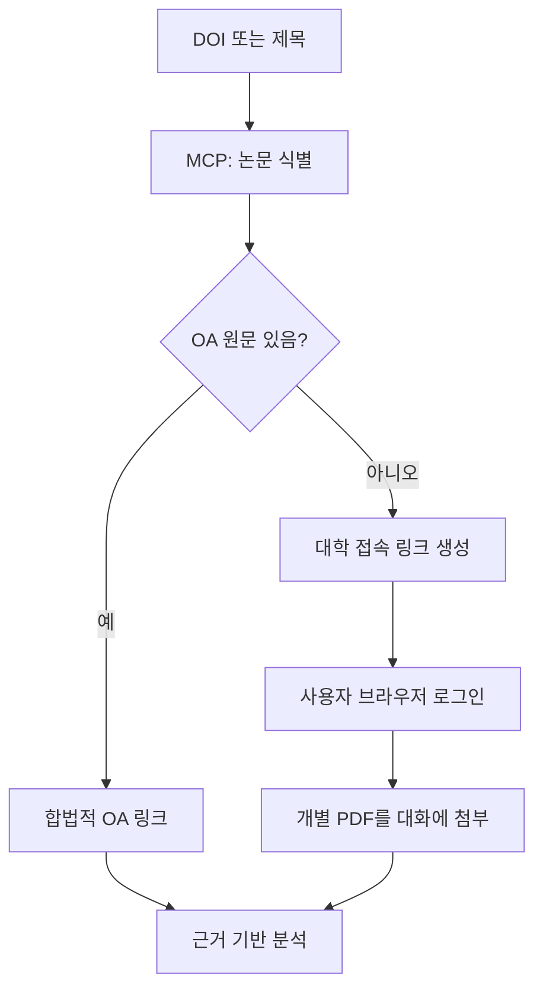

# UniPaper Bridge

논문 DOI/제목을 식별하고, 합법적인 오픈액세스(OA) 원문을 찾고, 사용자가 **자기 대학 계정으로 자기 브라우저에서** 접속하도록 연결하는 오픈소스 MCP 서버 + ChatGPT/Codex 플러그인입니다.

현재 0.1 MVP에는 경희대학교 서울캠퍼스와 국제캠퍼스 어댑터가 들어 있습니다. 다른 대학은 공개된 교외접속 규정을 확인한 뒤 `src/institutions.ts`에 어댑터를 추가할 수 있습니다.

## 안전 경계

이 서버가 하는 일:

- Crossref에서 DOI/제목 메타데이터 조회
- OpenAlex에서 보고된 OA 위치 조회
- 공식 대학 프록시 규칙으로 사용자에게 보여 줄 접속 링크 생성

이 서버가 하지 않는 일:

- 대학 아이디·비밀번호·MFA·쿠키·세션 수집
- 사용자의 Chrome 로그인 세션 상속
- 대학 또는 출판사에 대신 로그인
- 유료 PDF 다운로드·저장·재배포
- 저널/이슈 단위 자동 다운로드



## 제공 도구

| 도구 | 역할 | 외부 데이터 | 상태 변경 |
|---|---|---:|---:|
| `resolve_paper` | DOI 또는 제목으로 Crossref 메타데이터 식별 | Crossref | 없음 |
| `find_open_access` | DOI의 OA 위치 확인 | OpenAlex | 없음 |
| `list_institutions` | 지원 대학·캠퍼스와 공식 정책 나열 | 없음 | 없음 |
| `build_institution_link` | 승인된 어댑터로 접속 링크 생성 | 없음 | 없음 |

모든 도구는 read-only이며, `build_institution_link`는 URL을 서버에서 열지 않습니다.

## 로컬 실행 (macOS 포함)

준비물은 Node.js 20 이상과 무료 OpenAlex API 키입니다.

```bash
npm ci
cp .env.example .env
# .env에 OPENALEX_API_KEY를 입력
npm run check
npm start
```

기본 엔드포인트는 `http://127.0.0.1:3000/mcp`, 상태 확인은 `http://127.0.0.1:3000/healthz`입니다.

stdio 방식은 다음과 같습니다.

```bash
npm run build
node dist/index.js --stdio
```

MCP Inspector로 도구 목록과 호출 결과를 확인할 수 있습니다.

```bash
npx @modelcontextprotocol/inspector@latest
```

Inspector에서 command를 `node`, arguments를 `dist/index.js --stdio`로 설정하세요.

## ChatGPT/Codex 플러그인으로 로컬 설치

프로젝트에는 다음 파일이 포함됩니다.

- `.codex-plugin/plugin.json`: 플러그인 매니페스트
- `.mcp.json`: 번들된 stdio MCP 설정
- `skills/institutional-paper-reader/`: 논문 접근·분석 워크플로
- `.agents/plugins/marketplace.json`: 로컬 마켓플레이스

먼저 `npm ci && npm run build`를 실행합니다. 그다음 이 저장소를 로컬 마켓플레이스로 추가하고 ChatGPT 데스크톱 앱을 재시작합니다.

```bash
codex plugin marketplace add /absolute/path/to/unipaper-bridge
```

GitHub에 공개한 뒤에는 다른 사람이 다음처럼 추가할 수 있습니다.

```bash
codex plugin marketplace add OWNER/REPOSITORY
```

## 공개 ChatGPT 플러그인으로 배포

공개 ChatGPT 연결은 로컬 stdio가 아니라 안정적인 HTTPS Streamable HTTP 엔드포인트가 필요합니다.

1. [배포 가이드](docs/DEPLOYMENT.md)에 따라 `/mcp`를 HTTPS로 배포합니다.
2. ChatGPT 설정에서 Developer mode를 켜고 MCP URL을 연결합니다.
3. 생성된 `plugin_asdk_app...` 기술 ID로 `.app.json`을 추가합니다.
4. 운영자 신원, 공개 웹사이트, 개인정보처리방침·이용약관 URL, 지원 연락처를 매니페스트에 채웁니다.
5. 도구 스캔과 `evals/cases.json` 평가를 통과시킨 뒤 공개 디렉터리에 제출합니다.

0.1 서버는 사용자별 비공개 데이터를 읽거나 쓰지 않는 익명 read-only 서비스이므로 대학 OAuth를 구현하지 않습니다. 향후 서버가 개인 Zotero나 파일 저장소를 읽게 된다면 해당 기능에는 OAuth 2.1과 사용자별 권한 검사가 필요합니다.

## 경희대학교 어댑터

- 공식 교외접속 안내: https://lib.khu.ac.kr/webcontent/info/1
- 공식 공정이용 안내: https://lib.khu.ac.kr/webcontent/info/2
- 서울: `https://openlink.khu.ac.kr/link.n2s?url=`
- 국제: `https://webgate.khu.ac.kr/link.n2s?url=`

경희대 안내는 동일 출판사 기준 동일 PC/IP에서 1일 30건 이하, 전권·이슈 전체 다운로드 금지, 프로그램을 통한 지속 다운로드 금지, 계정 양도와 재배포 금지를 명시합니다. 이 프로젝트는 안전 여유를 두어 하루 20건을 작업상 상한으로 안내하지만 다운로드를 추적하거나 실행하지는 않습니다.

## 다른 대학 추가

`skills/institutional-paper-reader/references/adding-institutions.md`의 체크리스트를 따르세요. 반드시 대학 공식 공개 문서에서 링크 규칙과 이용 정책을 확인하고, 실제 계정·쿠키·사설 세션 URL·유료 PDF를 커밋하지 마세요.

## 개발

```bash
npm test
npm run build
npm run check
```

현재 테스트는 DOI 정규화, Crossref/OpenAlex 응답 변환, URL 안전성, KHU 링크 생성, MCP 도구 스키마와 안전 주석을 검증합니다.

## English summary

UniPaper Bridge is a privacy-preserving MCP server and plugin that resolves scholarly metadata, checks reported open-access locations, and creates institution-specific links. University authentication remains entirely in each user's browser; the server never handles credentials, browser sessions, or licensed PDFs.

## Licence

MIT. 기관 구독 콘텐츠 자체에는 이 라이선스가 적용되지 않으며, 사용자는 각 도서관·출판사·저작권 조건을 따라야 합니다.
