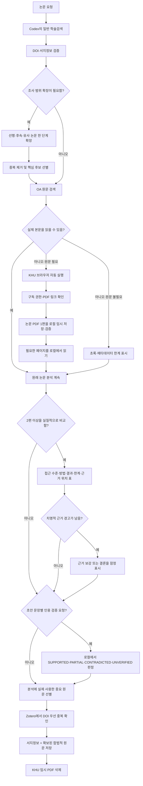

# UniPaper Bridge

논문을 일반 학술검색 흐름으로 조사하고, 핵심 논문의 선행·후속·유사 연구를
필요할 때 자동 확장한 뒤, 합법적인 오픈액세스(OA) 원문을 먼저 읽습니다.
필요한 원문을 끝내 읽을 수 없을 때만 사용자의 로컬 대학 접속을 자동으로
열고, 여러 논문의 접근 수준·방법·결과·한계·근거 위치를 검증 가능한 표로
묶습니다. 논문 초안이 있으면 문장별 주장을 읽은 원문과 대조해 DOI·페이지·
표·그림 위치까지 로컬에서 검증한 다음, 사용자가 허용하면 중요한 근거 논문을
로컬 Zotero에 중복 없이 저장하는 오픈소스 MCP 서버 + ChatGPT/Codex
플러그인입니다.

현재 0.5에는 제한된 인용 네트워크 확장, 다중 논문 근거표, 로컬 문장별 인용 검증, 경희대학교 서울캠퍼스·국제캠퍼스의 1회 1편 원문 확보·읽기·정리 흐름이 들어 있습니다. 다른 대학은 공개된 교외접속 규정을 확인한 뒤 공개 링크와 로컬 헬퍼 어댑터를 추가할 수 있습니다.

## 바로 연결하기

공개 배포된 MCP 주소:

```text
https://unipaper-bridge-mcp.kimmiso0821.chatgpt.site/api/mcp
```

상태 페이지는 [unipaper-bridge-mcp.kimmiso0821.chatgpt.site](https://unipaper-bridge-mcp.kimmiso0821.chatgpt.site), 상태 확인 API는 [`/healthz`](https://unipaper-bridge-mcp.kimmiso0821.chatgpt.site/healthz)입니다.

ChatGPT에서 **Settings → Security and login → Developer mode**를 켠 뒤 Plugins에서 새 연결을 추가하고 위 MCP 주소 전체를 입력하세요. 0.5 배포 후에는 `resolve_paper`, `expand_citation_network`, `find_open_access`, `build_evidence_matrix`, `list_institutions`, `build_institution_link` 여섯 공개 도구가 표시되어야 합니다. 미공개 초안을 받는 `audit_draft_claims`와 기관 원문을 다루는 도구는 공개 주소가 아니라 아래 로컬 플러그인 설치에서만 제공됩니다.

0.5 공개 서버 코드는 여섯 도구를 제공합니다. OpenAlex 키가 없어도
`expand_citation_network`와 `find_open_access`가 낮은 무키 사용량 한도에서
동작하지만, 여러 사람이 쓰는 배포에는 무료 `OPENALEX_API_KEY` 설정을
강력히 권장합니다. 공개 주소의 실제 도구 목록은 운영자가 0.5를 배포한 뒤
갱신됩니다.

## 안전 경계

공개 서버가 하는 일:

- Crossref에서 DOI/제목 메타데이터 조회
- OpenAlex에서 중요한 선행 참고문헌·후속 인용논문·주제 유사논문을 제한된
  한 단계로 확장하고 DOI/OpenAlex ID 기준으로 중복 제거
- OpenAlex에서 보고된 OA 위치 조회
- 호출자가 실제로 확인한 논문 2~30편의 DOI/제목 중복 제거, 접근 라벨과
  근거 위치 검증, Markdown·CSV 근거표 생성
- 공식 대학 프록시 규칙으로 사용자에게 보여 줄 접속 링크 생성

공개 서버가 하지 않는 일:

- 대학 아이디·비밀번호·MFA·쿠키·세션 수집
- 사용자의 Chrome 로그인 세션 상속
- 대학 또는 출판사에 대신 로그인
- 유료 PDF 다운로드·저장·재배포 또는 로컬 원문 수신
- 저널/이슈 단위 자동 다운로드
- 사용자의 미공개 논문 초안 수집·저장·문장별 검증



Zotero는 학술검색이나 원문 접근을 대신하는 단계가 아닙니다. 원래 논문
분석을 계속한 뒤, 그 분석에 실제로 사용한 중요한 원문을 보존하는 마지막
단계로만 실행됩니다.

## 사용 시나리오

한 편의 논문 조사, 유료 원문 기관접속, 여러 논문 비교, 초안 문장별 인용
검증, 체계적 문헌고찰과 결과물 출력 계획, Windows·macOS·Linux 공동 사용
과정은 [연구 워크플로 사용 시나리오](docs/WORKFLOW_SCENARIOS.md)에 예시 요청과
함께 정리되어 있습니다. 문서에서는 현재 0.5 기능과 계획 기능을 명확히
구분합니다.

## 제공 도구

| 도구 | 역할 | 외부 데이터 | 상태 변경 |
|---|---|---:|---:|
| `resolve_paper` | DOI 또는 제목으로 Crossref 메타데이터 식별 | Crossref | 없음 |
| `expand_citation_network` | DOI를 기준으로 선행·후속·유사 논문을 제한적으로 확장하고 중복 제거 | OpenAlex | 없음 |
| `find_open_access` | DOI의 OA 위치 확인 | OpenAlex | 없음 |
| `build_evidence_matrix` | 확인한 논문 근거를 중복 제거하고 접근 수준·근거 위치를 검증해 Markdown/CSV로 변환 | 없음 | 없음 |
| `list_institutions` | 지원 대학·캠퍼스와 공식 정책 나열 | 없음 | 없음 |
| `build_institution_link` | 승인된 어댑터로 접속 링크 생성 | 없음 | 없음 |

모든 도구는 read-only이며, `build_institution_link`는 URL을 서버에서 열지 않습니다.

## 선택 사항: 로컬 KHU 로그인·초안 검증·Zotero 자동 저장

공개 MCP의 인증 경계는 그대로 유지하면서, 사용자 컴퓨터의 운영체제 보안 저장소를 이용하는 별도 로컬 컴포넌트가 [`local/`](local/README.md)에 있습니다. macOS는 Keychain, Windows는 현재 사용자 범위 DPAPI, Linux 데스크톱은 Secret Service를 사용합니다.

```text
공개 MCP → 경희대 접속 URL만 생성
로컬 KHU MCP → 한 논문의 확보·검증·페이지 읽기·임시파일 삭제
격리된 헬퍼 → 전용 브라우저 세션 우선, 필요할 때만 OS 보안 저장소 조회
로컬 초안 MCP → 원문 근거 참조와 문장 상태 검증, 네트워크·파일·저장 없음
```

KHU MCP에는 `fetch_khu_paper`, `check_khu_paper_fetch`,
`read_khu_paper_pages`, `release_khu_paper`, 하위 호환용 `open_khu_paper`가 있으며 비밀번호 조회
도구는 없습니다. 한 호출은 사용자가 요청한 논문 1편만 처리합니다.
별도의 Zotero MCP는 Zotero Desktop의 로컬 포트만 사용해 상태 확인, 자동
저장 동의 설정, DOI 우선 중복 확인 및 개별 논문 저장을 수행합니다.
별도의 draft-audit MCP는 초안 문자 위치와 원자 주장, DOI, 접근 라벨,
페이지·표·그림 앵커를 검증해 `SUPPORTED`, `PARTIAL`, `CONTRADICTED`,
`UNVERIFIED`를 계산합니다. 논문을 대신 읽거나 초안을 수정·저장하지 않고
네트워크와 Zotero에도 접근하지 않습니다.
ID·비밀번호·쿠키·세션은 MCP 결과, 모델 응답, 명령행 인자, `.env`에
들어가지 않습니다. `local/` 전체는 Docker 배포에서 제외됩니다.

사용자가 KHU 스킬이나 도구를 따로 선택하는 구조가 아닙니다. 논문 관련
요청에서 `institutional-paper-reader`가 일반 검색과 공개 원문을 먼저
처리합니다. 문헌검토·연구공백·독창성 확인처럼 조사 범위가 중요한
요청에서는 검증된 핵심 논문 1~3편을 기준으로 인용 네트워크를 한 단계만
자동 확장하고, 일반 검색 결과와 중복을 제거한 뒤 중요한 후보만 원문 확인
단계로 보냅니다. 두 편 이상을 비교할 때는 실제 답변에 쓰일 논문만
`build_evidence_matrix`로 보내 DOI/제목 중복, 접근 라벨, 미확인 항목,
페이지·절·표·그림 근거 위치를 점검한 뒤 종합합니다. 이 도구는 논문을 대신
읽거나 빈칸을 추측하지 않습니다. 초안 검증 요청에서는 복합 문장을 원자
주장으로 나누고, 읽은 원문의 정확한 앵커와 의미를 비교한 뒤 로컬
`audit_draft_claims`가 출처 경계와 최종 문장 상태를 보수적으로 계산합니다.
실제 원문이 분석에 필요한데 읽을 수 없을 때만 `fetch_khu_paper`를 자동
호출합니다. 격리 브라우저가 구독 권한과 PDF 링크를 확인해 논문 1편을 임시
폴더에 저장하고, 로컬 MCP가 PDF 서명·크기·해시를 확인한 뒤 필요한 페이지를
최대 10쪽씩 읽습니다. 자동 탐색이 어려운 출판사에서는 같은 브라우저 안에서
PDF 버튼 한 번만 사용자에게 요청할 수 있지만, 다운로드 파일을 찾아 대화에
첨부하게 하지는 않습니다. 분석과 허용된 Zotero 저장이 끝나면 임시파일을
삭제합니다.
Zotero 자동 저장을 켜면 최종 답변에 실제로 쓰인 핵심 논문, 가장 가까운
경쟁 논문, 재사용한 방법·데이터 논문만 저장합니다. 검색 결과 전체나 다른
논문의 참고문헌 목록을 일괄 수집하지 않습니다. 공개 원문은 Zotero의 OA
검색으로 첨부하고, 기관 구독 원문은 로컬 헬퍼가 그 논문 1편에 대해 만든
검증된 임시 경로만 `licensed-pdf` 모드로 첨부합니다. PDF·쿠키·세션은 공개
서버나 GitHub로 전송되지 않습니다.

처음 한 번만 자신의 컴퓨터 터미널에서 실행하세요. 비밀번호 입력은 화면에 표시되지 않습니다.

```bash
npm ci
npm run build
npm run build:khu-helper
npm run setup:khu
```

macOS에서 매번 credential 사용 시 Touch ID를 요구하려면 `npm run setup:khu -- --touch-id`를 사용합니다. Windows와 Linux 설치 조건, 로컬 MCP 설치와 보안 검증 방법은 [`local/README.md`](local/README.md)를 따르세요.

후배에게는 소스 저장소나 릴리스 압축파일만 공유하세요. 설정된 헬퍼, 브라우저 프로필, Keychain/DPAPI/Secret Service 데이터는 공유하지 않으며, 각 사용자가 자신의 컴퓨터에서 자신의 학교 계정으로 `npm run setup:khu`를 실행해야 합니다.

후배에게 전달할 간단한 운영체제별 설명은 [`local/INSTALL-KO.md`](local/INSTALL-KO.md)에 정리되어 있습니다.

## 로컬 실행 (macOS 포함)

준비물은 Node.js 20 이상입니다. 무료 OpenAlex API 키는 선택 사항이지만,
여러 논문을 계속 조사할 때는 사용량 한도를 높이기 위해 권장합니다.

```bash
npm ci
cp .env.example .env
# 권장: .env에 OPENALEX_API_KEY를 입력
npm run check
npm start
```

기본 엔드포인트는 `http://127.0.0.1:3000/mcp`, 상태 확인은 `http://127.0.0.1:3000/healthz`입니다.

stdio 방식은 다음과 같습니다.

```bash
npm run build
node dist/index.js --stdio
```

MCP Inspector로 도구 목록과 호출 결과를 확인할 수 있습니다.

```bash
npx @modelcontextprotocol/inspector@latest
```

Inspector에서 command를 `node`, arguments를 `dist/index.js --stdio`로 설정하세요.

## ChatGPT/Codex 플러그인으로 로컬 설치

프로젝트에는 다음 파일이 포함됩니다.

- `.codex-plugin/plugin.json`: 플러그인 매니페스트
- `.mcp.json`: 번들된 stdio MCP 설정
- `skills/institutional-paper-reader/`: 논문 접근·분석 워크플로
- `skills/draft-claim-auditor/`: 초안 문장별 DOI·근거 위치 검증 워크플로
- `.agents/plugins/marketplace.json`: 로컬 마켓플레이스

먼저 `npm ci`, `npm run build`, `npm run build:khu-helper`를 실행합니다.
그다음 저장소 전체를 로컬 마켓플레이스로 추가하고 플러그인 하나를
설치합니다. 이 한 설치에 세 연구 스킬, 공개 MCP, 로컬 KHU MCP, 로컬
초안 검증 MCP, 로컬 Zotero MCP가 모두 포함됩니다. Zotero 자동 저장은 사용자가 명시적으로
켜기 전에는 동작하지 않습니다.

```bash
codex plugin marketplace add /absolute/path/to/unipaper-bridge
codex plugin add unipaper-bridge@unipaper-local
```

Git 저장소만 직접 마켓플레이스로 추가하면 빌드 산출물이 없으므로 로컬 MCP를
실행할 수 없습니다. 다른 사용자도 저장소를 먼저 clone하고 위 빌드 명령을
실행한 뒤, clone한 절대 경로를 마켓플레이스로 추가해야 합니다.

## 공개 ChatGPT 플러그인으로 배포

공개 ChatGPT 연결은 로컬 stdio가 아니라 안정적인 HTTPS Streamable HTTP 엔드포인트가 필요합니다.

1. 위 공개 MCP 주소를 사용하거나 [배포 가이드](docs/DEPLOYMENT.md)에 따라 직접 HTTPS로 배포합니다.
2. ChatGPT 설정에서 Developer mode를 켜고 MCP URL을 연결합니다.
3. 생성된 `plugin_asdk_app...` 기술 ID로 `.app.json`을 추가합니다.
4. 운영자 신원, 공개 웹사이트, 개인정보처리방침·이용약관 URL, 지원 연락처를 매니페스트에 채웁니다.
5. 도구 스캔과 `evals/cases.json` 평가를 통과시킨 뒤 공개 디렉터리에 제출합니다.

공개 서버는 사용자별 비공개 데이터를 읽거나 쓰지 않는 익명 read-only
서비스입니다. 미공개 초안 검증과 개인 Zotero 작업은 사용자의 컴퓨터
안에서만 실행되는 별도 stdio MCP가 담당하며 공개 서버로 전달되지 않습니다.

## 경희대학교 어댑터

- 공식 교외접속 안내: https://lib.khu.ac.kr/webcontent/info/1
- 공식 공정이용 안내: https://lib.khu.ac.kr/webcontent/info/2
- 서울: `https://openlink.khu.ac.kr/link.n2s?url=`
- 국제: `https://webgate.khu.ac.kr/link.n2s?url=`

경희대 안내는 동일 출판사 기준 동일 PC/IP에서 1일 30건 이하, 전권·이슈 전체 다운로드 금지, 프로그램을 통한 지속 다운로드 금지, 계정 양도와 재배포 금지를 명시합니다. 이 프로젝트는 안전 여유를 두어 하루 20건을 작업상 상한으로 안내하지만 다운로드를 추적하거나 실행하지는 않습니다.

## 다른 대학 추가

`skills/institutional-paper-reader/references/adding-institutions.md`의 체크리스트를 따르세요. 반드시 대학 공식 공개 문서에서 링크 규칙과 이용 정책을 확인하고, 실제 계정·쿠키·사설 세션 URL·유료 PDF를 커밋하지 마세요.

## 개발

```bash
npm test
npm run build
npm run check
```

현재 테스트는 DOI 정규화, Crossref/OpenAlex 응답 변환, 인용 네트워크의
순위·제한·중복 제거·입장 미판정 규칙, 근거표 중복 제거·접근 수준·근거 위치
품질 검사와 Markdown/CSV 출력, URL 안전성, KHU 링크 생성, MCP 도구 스키마와
안전 주석을 검증합니다. 로컬 검증은 초안 오프셋 일치, 원자 주장 집계,
접근 수준별 판정 제한, 상충·철회·메타데이터 근거 차단도 검사합니다.

크로스플랫폼 로컬 헬퍼까지 검증하려면 `npm run check:local`을 추가로 실행합니다. 실제 비밀번호 없이 출력 차단, 허용 URL, 세션 우선 접근, 로컬 MCP 도구 계약을 검사합니다.

공개 배포용 buildless Worker 구현은 [`deploy/sites-worker.js`](deploy/sites-worker.js)에 함께 공개되어 있습니다. Node/Express 서버와 동일한 여섯 도구 및 브라우저 인증 경계를 유지하며 공개 엔드포인트는 `/api/mcp`입니다.

## English summary

UniPaper Bridge is a privacy-preserving MCP server and plugin that resolves scholarly metadata, expands bounded citation networks, checks open-access locations, validates multi-paper evidence matrices, audits unpublished draft claims through a local read-only MCP, and creates institution-specific links. University authentication remains in each user's browser; unpublished drafts, credentials, browser sessions, and licensed PDFs are never sent to the hosted UniPaper service.

## Licence

MIT. 기관 구독 콘텐츠 자체에는 이 라이선스가 적용되지 않으며, 사용자는 각 도서관·출판사·저작권 조건을 따라야 합니다.
